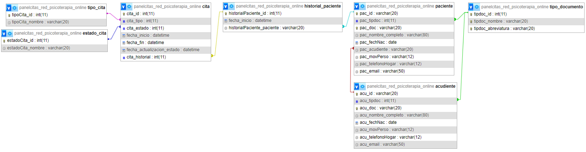

# PanelCitas_Red_Psicoterapia_Online

## Descripcion
---
- Proyecto enfocado en la creacion del backend para creacion , asignacion y manipulacion de citas y horarios para red de psicoterapia online.
---
## Objetivo general
---
- Crear la estructura backend haciendo uso de tecnologias, para poder gestionar y asignar citas para usuarios de una red de psicoterapia online.

---
## Diagrama Entidad Relacion
---

---
## Objetivos especificos
---
- Crear una base de datos normalizada en sql.
- Crear el crud para las tablas de la base de datos.
- Crear los endpoints que sean necesarios segun las necesidades de el proyecto
- Utilizar estandares de seguridad como DTO para realizar el trabajo de forma integra