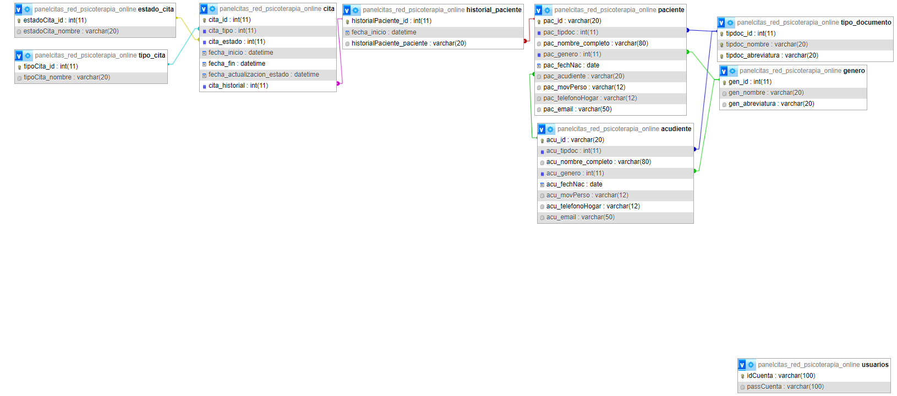

# PanelCitas_Red_Psicoterapia_Online

## Descripcion
---
- Proyecto enfocado en la creacion del backend para creacion , asignacion y manipulacion de citas y horarios para red de psicoterapia online.
---
## Objetivo general
---
- Crear la estructura backend haciendo uso de tecnologias, para poder gestionar y asignar citas para usuarios de una red de psicoterapia online.

---
## Diagrama Entidad Relacion
---



---
## Objetivos especificos
---
- Crear una base de datos normalizada en sql.
- Crear el crud para las tablas de la base de datos.
- Crear los endpoints que sean necesarios segun las necesidades de el proyecto
- Utilizar estandares de seguridad como DTO para realizar el trabajo de forma integra

---
## Modo de uso:
---
1. Clonar el repositorio en su dispositivo
2. Ingresar a la carpeta backend > scripts y seleccionar el archivo script_database 
3. Ejecutar paso a paso el archivo para crear la base de datos de manera local, para esto recuerde que primero debe seguir los siguientes pasos:
   - 3.1. Corrobore tener Apache y Mysql instalados y corriendo en su ordenador
   - 3.2. Ejecute el comando "mysql -u root -p;"
   - 3.3. Si no muestra ningun error, Ejecute el comando "SHOW DATABASES;" y asegurese de no tener ninguna base de datos con el nombre "PanelCitas_Red_Psicoterapia_Online"
   - 3.4. Ahora ejecute uno a uno los comandos del archivo scriptDatabase
4. Revise que las configuraciones del archivo .env coincidan con las de su ordenador, si no es el caso cambielas
5. Abra un nuevo bloque de comandos desde el archivo del repositorio, si esta usando visual estudio puede hacerlo desde la pestaña terminal > new terminal
6. Con el comando "cd backend"  ingrese a la carpeta backend
7. Ejecute el comando "npm install"
8. Ejecute el comando "npm run dev"
9. La consola le mostrara la direccion http donde esta corriendo el servidor, la cual de manera predeterminada es "http://127.9.63.7:5000"
10. Para interactuar con los enpoints es recomendable usar una extension como Thunder Client, para ello siga los siguientes pasos:
   - 10.1. Descarge la extension Thunder Client desde visual studio code
   - 10.2. En el panel izquierdo seleccione la extension Thunder Client y posteriormente en new request
   - 10.3. Coloque la url en el panel de direccion de Thunder Client con el endpoint especifico
   - 10.4. Seleccione el metodo de la peticion segun corresponda
   - 10.5. Si es un metodo POST envie un objeto en formato JSON con la informacion requerida en la pestaña body de Thunder Client

---
## Consultas SQL
---
La api desde el script de la base de datos contiene datos predeterminados como el tipo de cita, el estado de la cita, el genero entre otros, sin embargo, estos datos pueden ser modificados desde los diferentes endpoints que proporciona la api.

La api se encuentra estructurada de tal manera que cada tabla contiene su correspondiente CRUD basico compuesto por los metodos get, post, put y delete, los cuales pueden ser accedidos a travez de la url con los siguientes endpoints:

### Tabla tipoCita:

El tipo de cita hace referencia a la categorizacion de las citas segun los criterios del profesional, estas pueden ser inicialmente citas de control o primera cita.

1. Get
    - URL: http://127.9.63.7:5000/api/get/tipoCita
    - Metodo: get
    - Lectura Datos: query
        - ej: http://127.9.63.7:5000/api/get/tipoCita?id=123456
    - Descripcion: Dependiendo de la informacion en el query, si en este no se encuentra nada proporciona todos los tipos de cita, si en esta se encuentra el parametro id seguido del id de algun tipo de cita existente proporciona la informacion de dicho tipo de cita.

2. Post
    - URL: http://127.9.63.7:5000/api/post/tipoCita
    - Metodo: post
    - Lectura Datos: body
        - ej: 
        ```json
        {
          "nombre": "Urgencia"  
        }
        ```
    - Descripcion: crea un nuevo registro para el tipo de cita con los datos encontrados en el body.
3. Put
    - URL: http://127.9.63.7:5000/api/put/tipoCita
    - Metodo: put
    - Lectura Datos: body
        - ej: 
        ```json
        {
          "id": 3,
          "nombre": "Emergencia" 
        }
        ```
    - Descripcion: modifica un registro existente para el tipo de cita con los datos encontrados en el body.

4. Delete:
    - URL: http://127.9.63.7:5000/api/delete/tipoCita
    - Metodo: delete
    - Lectura Datos: query
        - ej: http://127.9.63.7:5000/api/get/tipoCita?id=123456
    - Descripcion: elimina un registro existente en la tabla tipoCita a partir del id proporcionado en el query.

### Tabla estadoCita:

El estado de cita hace referencia a la categorizacion de las citas e cuanto a su temporalidad, estas pueden ser cancelada, activa, suspendida, etc.

1. Get
    - URL: http://127.9.63.7:5000/api/get/estadoCita
    - Metodo: get
    - Lectura Datos: query
        - ej: http://127.9.63.7:5000/api/get/estadoCita?id=123456
    - Descripcion: Dependiendo de la informacion en el query, si en este no se encuentra nada proporciona todos los estados de cita, si en esta se encuentra el parametro id seguido del id de algun estado de cita existente proporciona la informacion de dicho estado de cita.

2. Post
    - URL: http://127.9.63.7:5000/api/post/estadoCita
    - Metodo: post
    - Lectura Datos: body
        - ej: 
        ```json
        {
          "nombre": "Borrada"  
        }
        ```
    - Descripcion: crea un nuevo registro para elestado de cita con los datos encontrados en el body.
3. Put
    - URL: http://127.9.63.7:5000/api/put/estadoCita
    - Metodo: put
    - Lectura Datos: body
        - ej: 
        ```json
        {
          "id": 3,
          "nombre": "Eliminada" 
        }
        ```
    - Descripcion: modifica un registro existente para el estado de cita con los datos encontrados en el body.

4. Delete:
    - URL: http://127.9.63.7:5000/api/delete/estadoCita
    - Metodo: delete
    - Lectura Datos: query
        - ej: http://127.9.63.7:5000/api/get/estadoCita?id=123456
    - Descripcion: elimina un registro existente en la tabla estadoCita a partir del id proporcionado en el query.

### Tabla tipoDocumento:

El tipo de documento hace referencia a los tipos de documento establecidos en la legislacion colombiana

1. Get
    - URL: http://127.9.63.7:5000/api/get/tipoDocumento
    - Metodo: get
    - Lectura Datos: query
        - ej: http://127.9.63.7:5000/api/get/tipoDocumento?id=123456
    - Descripcion: Dependiendo de la informacion en el query, si en este no se encuentra nada proporciona todos los tipos de documento, si en esta se encuentra el parametro id seguido del id de algun tipo de documento existente proporciona la informacion ded icho tipo de documento.

2. Post
    - URL: http://127.9.63.7:5000/api/post/tipoDocumento
    - Metodo: post
    - Lectura Datos: body
        - ej: 
        ```json
        {
          "nombre": "Cedula de Ciudadania",
          "abreviatura": "CdC"
        }
        ```
    - Descripcion: crea un nuevo registro para el tipo de documento con los datos encontrados en el body.
3. Put
    - URL: http://127.9.63.7:5000/api/put/tipoDocumento
    - Metodo: put
    - Lectura Datos: body
        - ej: 
        ```json
        {
          "id": 3,
          "nombre": "Cedula de Ciudadania",
          "abreviatura": "CC"
        }
        ```
    - Descripcion: modifica un registro existente para el tipo de documento con los datos encontrados en el body.

4. Delete:
    - URL: http://127.9.63.7:5000/api/delete/tipoDocumento
    - Metodo: delete
    - Lectura Datos: query
        - ej: http://127.9.63.7:5000/api/get/tipoDocumento?id=123456
    - Descripcion: elimina un registro existente en la tabla tipoDocumento a partir del id proporcionado en el query.


### Tabla genero:
La tabla "genero" contiene los diferentes géneros o sexos establecidos en la legislación colombiana.

1. Get:

    - URL: http://127.9.63.7:5000/api/get/genero
    - Método: GET
    - Lectura Datos: Query
    - Ejemplo: http://127.9.63.7:5000/api/get/genero?id=1
    - Descripción: Dependiendo de la información en el query, si este no contiene nada, proporciona todos los géneros registrados. Si el query incluye el parámetro "id" seguido del id de algún género existente, proporciona la información de dicho género.

2. Post:

    - URL: http://127.9.63.7:5000/api/post/genero
    - Método: POST
    - Lectura Datos: Body
    - Ejemplo:
        - ej: 
        ```json
        {
          "nombre": "Cedula de Ciudadania",
          "abreviatura": "CdC"
        }
    - Descripción: Crea un nuevo registro para el género con los datos proporcionados en el body.

3. Put

    - URL: http://127.9.63.7:5000/api/put/genero
    - Método: PUT
    - Lectura Datos: Body
    - Ejemplo:
    - json
        - ej: 
        ```json
        {
          "id": 3,
          "nombre": "Cedula de Ciudadania",
          "abreviatura": "CC"
        }
        ```
    - Descripción: Modifica un registro existente para el género con los datos proporcionados en el body.

4. Delete:

    - URL: http://127.9.63.7:5000/api/delete/genero
    - Método: DELETE
    - Lectura Datos: Query
    - Ejemplo: http://127.9.63.7:5000/api/delete/genero?id=2
    - Descripción: Elimina un registro existente en la tabla "genero" basado en el id proporcionado en el query.

### Tabla Acudiente:

La tabla "acudiente" se usa para almacenar la informacion de los acudientes de aquellos pacientes menores de edad, es obligatoria la existencia de un acudiente para todos los pacientes menores de 18 años.

1. Get
    - URL: http://127.9.63.7:5000/api/get/acudiente
    - Metodo: get
    - Lectura Datos: query
        - ej: http://127.9.63.7:5000/api/get/acudiente?id=123456
    - Descripcion: Dependiendo de la informacion en el query, si en este no se encuentra nada proporciona todos los acudientes, si en esta se encuentra el parametro id seguido de el documento del acudiente proporciona la informacion de dicho acudiente.

2. Post
    - URL: http://127.9.63.7:5000/api/post/acudiente
    - Metodo: post
    - Lectura Datos: body
        - ej: 
        ```json
        {
          "id": 12345678,
          "tipoDocumento": 1,
          "nombre": "Paco Alberto Gomez Prada",
          "genero": 1,
          "fechaNacimiento": "1980-03-21",
          "telefPersonal": "3175478569",
          "telefHogar": "6045896523",
          "email": "correo@dominio.com"  
        }
        ```
    - Descripcion: crea un nuevo registro para el acudiente con los datos encontrados en el body, recuerde que unicamente el telefono del hogar es opcional, todos los demas datos son necesarios.

3. Put
    - URL: http://127.9.63.7:5000/api/put/acudiente
    - Metodo: put
    - Lectura Datos: body
        - ej: 
        ```json
        {
          "id": "12345678",
          "tipoDocumento": 1,
          "nombre": "Paco Alverto Gomez Prada",
          "genero": 1,
          "fechaNacimiento": "1980-03-22",
          "telefPersonal": "3154896521",
          "telefHogar": "6045869523"(opcional),
          "email": "correo@dominio.com"  
        }
        ```
    - Descripcion: modifica un registro existente para el acudiente con los datos encontrados en el body, recuerde que unicamente el telefono del hogar es opcional, todos los demas datos son necesarios.

4. Delete:
    - URL: http://127.9.63.7:5000/api/delete/acudiente
    - Metodo: delete
    - Lectura Datos: query
        - ej: http://127.9.63.7:5000/api/get/acudiente?id=123456
    - Descripcion: elimina un registro existente a partir del id proporcionado en el query.

### Tabla Paciente:

La tabla "paciente" se utiliza para almacenar la información de los pacientes, incluyendo aquellos que son menores de edad. En caso de que un paciente sea menor de 18 años, se debe asociar obligatoriamente a un acudiente en la columna "acudiente".

1. Get
    - URL: http://127.9.63.7:5000/api/get/paciente
    - Método: GET
    - Lectura de Datos: query
    - Ejemplo: http://127.9.63.7:5000/api/get/paciente?id=123456
    - Descripción: Dependiendo de la información en el query, si no se encuentra ningún parámetro, se proporcionan todos los pacientes. Si se incluye el parámetro "id" seguido del documento del paciente, se obtiene la información de dicho paciente.

2. Post
    - URL: http://127.9.63.7:5000/api/post/paciente
    - Método: POST
    - Lectura de Datos: body
    - Ejemplo:
    ```json
    {
      "id": "12345678",
      "tipoDocumento": 1,
      "nombre": "Juanita Pérez",
      "genero": 2,
      "fechaNacimiento": "2005-07-15",
      "telefPersonal": "3175489632",
      "telefHogar": "6045896321",
      "email": "juanita@mail.com",
      "acudiente": "123456"  
    }
    ```
    - Descripción: Crea un nuevo registro para el paciente con los datos proporcionados en el body. Es importante tener en cuenta que la columna "acudiente" es obligatoria para pacientes menores de edad y debe hacer referencia al id del acudiente correspondiente.

3. Put
    - URL: http://127.9.63.7:5000/api/put/paciente
    - Método: PUT
    - Lectura de Datos: body
    - Ejemplo:
    ```json
    {
      "id": "12345678",
      "tipoDocumento": 1,
      "nombre": "Juanita Pérez Gómez",
      "genero": 2,
      "fechaNacimiento": "2005-07-15",
      "telefPersonal": "3155489632",
      "telefHogar": "6045896321",
      "email": "juanita.perez@mail.com",
      "acudiente": "123456"
    }
    ```
    - Descripción: Modifica un registro existente del paciente con los datos proporcionados en el body. Es importante tener en cuenta que la columna "acudiente" es obligatoria para pacientes menores de edad y debe hacer referencia al id del acudiente correspondiente.

4. Delete:
    - URL: http://127.9.63.7:5000/api/delete/paciente
    - Método: DELETE
    - Lectura de Datos: query
    - Ejemplo: http://127.9.63.7:5000/api/delete/paciente?id=12345678
    - Descripción: Elimina un registro existente a partir del id del paciente proporcionado en el query. Si el paciente es menor de edad y tiene un acudiente asociado, la eliminación debe manejarse adecuadamente para evitar problemas de integridad de datos.

### Tabla Historial Paciente:

La tabla "historialPaciente" se utiliza para almacenar el historial de los pacientes, manteniendo un registro de sus cambios y actualizaciones.

1. Get
    - URL: http://127.9.63.7:5000/api/get/historialPaciente
    - Método: GET
    - Lectura de Datos: query
    - Ejemplo: http://127.9.63.7:5000/api/get/historialPaciente?id=123
    - Descripción: Dependiendo de la información en el query, si no se encuentra ningún parámetro, se proporcionan todos los registros del historial de pacientes. Si se incluye el parámetro "id" seguido del identificador del historial, se obtiene la información de dicho registro. Si se incluye el parametro "paciente" seguido de la identificacion del paciente se desplegara el historial asociado a ese paciente

2. Post
    - URL: http://127.9.63.7:5000/api/post/historialPaciente
    - Método: POST
    - Lectura de Datos: body
    - Ejemplo:
    ```json
    {
      "paciente": "123456"
    }
    ```
    - Descripción: Crea un nuevo registro en el historial de pacientes con el identificador del paciente al que se hace referencia. El campo "id" es un valor numérico autonumerado, por lo que no es necesario incluirlo en el body al realizar la solicitud POST.

3. Put
    - URL: http://127.9.63.7:5000/api/put/historialPaciente
    - Método: PUT
    - Lectura de Datos: body
    - Ejemplo:
    ```json
    {
      "id": 123,
      "paciente": "789012"
    }
    ```
    - Descripción: Modifica un registro existente en el historial de pacientes. Se debe proporcionar el identificador del historial a modificar en el campo "id", y el campo "paciente" debe contener el nuevo identificador del paciente al que se hace referencia.

4. Delete:
    - URL: http://127.9.63.7:5000/api/delete/historialPaciente
    - Método: DELETE
    - Lectura de Datos: query
    - Ejemplo: http://127.9.63.7:5000/api/delete/historialPaciente?id=123
    - Descripción: Elimina un registro existente del historial de pacientes a partir del id proporcionado en el query. Es importante considerar las implicaciones de integridad de datos al eliminar un registro del historial del paciente.

### Tabla Cita:

La tabla "cita" se utiliza para almacenar la información de las citas programadas para los pacientes.

1. Get
    - URL: http://127.9.63.7:5000/api/get/cita
    - Método: GET
    - Lectura de Datos: query
    - Ejemplo: http://127.9.63.7:5000/api/get/cita?id=123
    - Descripción: Dependiendo de la información en el query, si no se encuentra ningún parámetro, se proporcionan todas las citas programadas. Si se incluye el parámetro "id" seguido del identificador de la cita, se obtiene la información de dicha cita.

2. Post
    - URL: http://127.9.63.7:5000/api/post/cita
    - Método: POST
    - Lectura de Datos: body
    - Ejemplo:
    ```json
    {
      "tipo": 1,
      "estado": 2,
      "inicio": "2023-07-23 10:00:00",
      "fin": "2023-07-23 11:00:00",
      "historial": 456
    }
    ```
    - Descripción: Crea un nuevo registro para la cita con los datos proporcionados en el body. El campo "id" es un valor numérico autonumerado, por lo que no es necesario incluirlo en el body al realizar la solicitud POST. Es importante asegurarse de que la hora de finalización de la cita siempre sea posterior a la hora de inicio.

3. Put
    - URL: http://127.9.63.7:5000/api/put/cita
    - Método: PUT
    - Lectura de Datos: body
    - Ejemplo:
    ```json
    {
      "id": 123,
      "tipo": 2,
      "estado": 3,
      "inicio": "2023-07-24 15:30:00",
      "fin": "2023-07-24 16:30:00",
      "historial": 789
    }
    ```
    - Descripción: Modifica un registro existente de la cita con los datos proporcionados en el body. Es importante asegurarse de que la hora de finalización de la cita siempre sea posterior a la hora de inicio.

4. Delete:
    - URL: http://127.9.63.7:5000/api/delete/cita
    - Método: DELETE
    - Lectura de Datos: query
    - Ejemplo: http://127.9.63.7:5000/api/delete/cita?id=123
    - Descripción: Elimina un registro existente de la cita a partir del id proporcionado en el query. Es importante considerar las implicaciones de integridad de datos al eliminar una cita.

---
# Creador:
## Andrès David ELizalde Peralta
---
